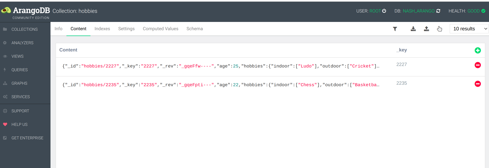

# spark-arangodb-to-bigquery-ingestion
This repository demonstrate the ETL Pipeline to ingest data from arangodb to big query using spark

## Local Setup

### Requirement
--install python 3
--install spark 3.4
check requirement.txt file

---install gcloud sdk
https://cloud.google.com/sdk/docs/install

--- GCP credential (service account key)
keep the json file in the project directory with a file name key.json

## Steps to run Locally

1. Start arangoDb locally.  run ``` sudo docker-compose up -d``` 
2. create arangoDB database "nash_arango"
3. Switch to nash_arango database and create collection hobbies.
4. Insert documents -
```{
"id": 7,
"name": "John Doe",
"age": 22,
"updatedAt": 1695569714963,
"hobbies": {
"indoor": [
"Chess"
],
"outdoor": [
"BasketballStand-up Comedy"
]
}
}

{
"id": 5,
"name": "Steve Doe",
"age": 25,
"updatedAt": 1695569714963,
"hobbies": {
"indoor": [
"Ludo"
],
"outdoor": [
"Cricket"
]
}
}
```


5. ```export GOOGLE_APPLICATION_CREDENTIALS=key.json```
6. ```gcloud auth activate-service-account --key-file=$GOOGLE_APPLICATION_CREDENTIALS```
7.  
```
   python arangotobq.py \
    --master local[*] \
    --arangoPassword rootpassword \
    --arangoEndpoints localhost:8529 \
    --bqProjectId 	bq-project-id \
    --bqDataSet person_details \
    --arangoDatabase nash_arango \
    --arangoCollection hobbies \
    --bqTargetTable person_hobbies \
    --fullLoadOrIncremental full_load \
    --incrementLoadDeltaTime 1
  ```

if --fullLoadOrIncremental full_load, then full load ingestion. For incremental, use
--fullLoadOrIncremental incremental and --incrementLoadDeltaTime 2(it is in hour)


